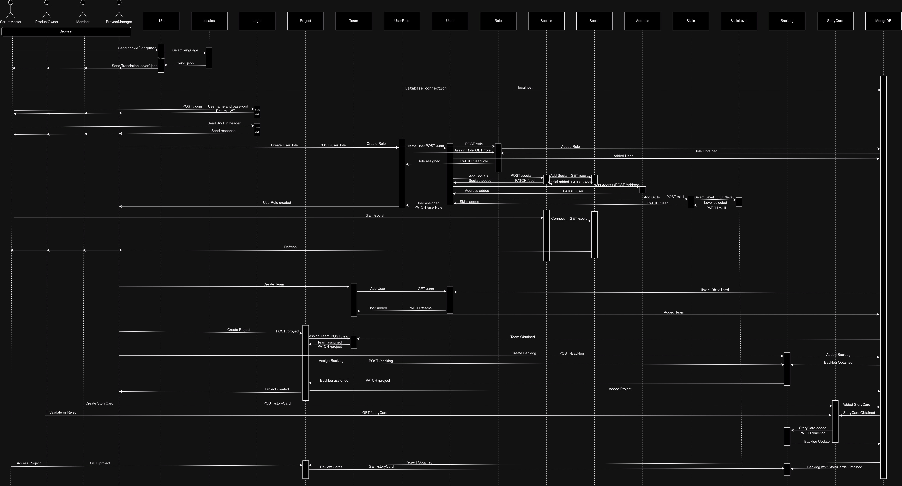

## Proyecto reto II: Desarrollar un manejador de proyectos

Web Platforms

## Unidad II

Programación web del lado del servidor

## Lenguaje de Programación

Javascript

Versión de node: v18.13.0

Versión de express: 4.16.1

# Autores

- **Daniel Josue Lozano Porras** - 348603 - [Daniel3486](https://gitlab.com/a348603)

- **Juan Antonio Díaz Fernández** - 348637 - [JUAN ANTONIO DIAZ FERNANDEZ](https://gitlab.com/a348637)

- **Jocelyn Soto Avila** - 348687 - [JOCELYN SOTO AVILA](https://gitlab.com/a348687)

- **Diego Martínez González** - 353198 - [DiegoMTZGlz](https://github.com/DiegoMTZGlz)

## Instrucciones

En esta publicación encontraras el documento que contiene el marco del proyecto a desarrollar durante el curso y tendrá valor en cada parcial según los criterios de evaluación. Toma en cuenta las siguientes cuestiones:

1. Selecciona tu equipo (el número de integrantes dependerá de lo acordado en clase).

2. Comprendan el documento adjunto y discutan entre los integrantes del equipo.

3. Sí existen dudas pregunten inmediatamente en la publicación o con el profesor en clase.

4. Al final de cada periodo existirá una tarea donde se deberá entregar los puntos a evaluar (uno por cada periodo).

5. Recuerda que se evalúa calidad del código, completitud del proyecto, funcionalidades, entrega a tiempo, participación de todo el equipo y correcta documentación y pruebas.

Para el primer parcial se evaluara lo siguiente:

1. Estructura del proyecto (20 puntos).

2. Diagrama de clases que cubra todos los requerimientos solicitados (20 puntos).

3. Todas las rutas necesarias para que el proyecto funcione con base al modelo REST y el diagrama de clases (20 puntos).

4. Diagrama de interacción que explique el flujo según los requerimientos. (20 puntos).

5. Imagen de docker funcional en docker hub (20 puntos).

Se espera como entregable la dirección del repositorio de gitlab con su respectivo archivo readme que explique los diagramas anteriores y que contenga la documentación del proyecto. Cada miembro del equipo debe subir la liga del repositorio.

## Instrucciones de Usos

1. Clonar el repositorio:

```
git clone git@gitlab.com:webdeads/project-manager.git
```

2. Esribir el siguiente comando, esto hará que se instalen las dependencias de node, y el `package-lock.json`:

```
npm install
```

3. Para ejecutar el servidor:

```
npm start
```

4. Dirigirse a su buscardor de confianza y en la barra de navegación colocar:

```
http://localhost:3000/
```

5. Si se quiere apagar el servidor: `Ctrl + C`

## Back4App

- **Link** - [Back4App](https://videoclub-olxlme8c.b4a.run/)

## Descripción del Diagrama de Clases

Los requisitos de la empresa han sido plasmados en los siguientes puntos:
    
• La empresa requiere llevar los expedientes por `proyecto` de desarrollo con la siguiente
    documentación y datos: **nombre del proyecto**, **fecha de solicitud de proyecto**, **fecha de
    arranque del proyecto**, **descripción del proyecto**, `proyect manager` (scrum master), `product
    owner` y su `equipo de desarrollo` involucrado.

• Por cada miembro del equipo de desarrollo se requiere saber: **nombre completo**, **fecha
    nacimiento**, **CURP**, **RFC**, **domicilio** y una **lista de habilidades**.

• Las `habilidades` son ranqueadas por **junior, senior y master**. Por ejemplo Juan es un
    desarrollador java nivel master pero javascript nivel junior
    
• Todos los `usuario` del sistema deben poder iniciar sesión en el sistema por medio de mínimo tres `redes sociales`.

• Cada usuario cumple un `rol` dentro de un proyecto con diferentes `permisos`.

Cada proyecto esta basado por estándar en la metodología de desarrollo de software ágil
SCRUM, el cual debe contar con el siguiente tablero de control:
    
• Debe estar divido en las columnas `product backlog`, `release backlog` (varias por tableros), `sprint backlog` (varios por backlog).

• Se debe poder cargar `tarjetas` o `historias de usuario`.

Las palabras que estan dentro de un recuadro representan `clases` y las que estan en negritas son **métodos**.

`Diagrama de Clases`


## Descripción del Diagrama de Secuencia

La funcionalidad de la plataforma ha sido plasmada en el diagrama acorde a los siguientes puntos:

• Creación de:

- Usuarios y sus roles.

- Proyectos con sus respectivos equipos.

• Inicios de sesión.

• Creaciòn de tarjetas.

• Validación o rechazo de tarjetas.

• Revisión de proyectos con sus respectivas tarjetas.

• Implementación de componentes de seguridad (JWT).

• Internacionalización.

• Comunicación con el PaaS de Mongodb Atlas.

`Diagrama de Secuencia`


